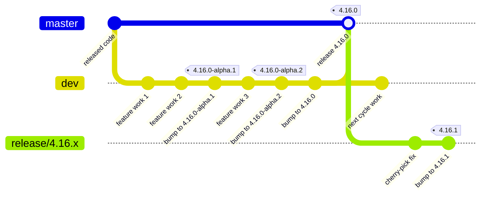

# Development and Release Flow

This document explains how code moves through Rocket.Chat Desktop, from a
feature branch to a published release. It is written for anyone
contributing to the project, not only release managers. For the exact
commands used to cut a release, see `docs/release-process.md`; this document
covers the shape of the model and the reasoning behind it.

## Overview

The project uses three kinds of branches with distinct roles. `master`
holds only released code — every commit on it corresponds to something that
has shipped or is about to ship. `dev` is where all development converges:
every feature and fix is merged there first, and alpha releases are tagged
directly from it. `release/X.Y.x` branches exist only after a stable
version has shipped, to carry patches for that version without pulling in
unrelated work that has since landed on `dev`. This separation keeps
`master` a stable, auditable history of what was actually released, while
`dev` stays free to move fast.

## Branch roles

| Branch | Purpose | Who merges into it | Merge method |
|---|---|---|---|
| `dev` | Default branch; integration point for all feature and fix PRs; source of alpha tags | Any contributor via PR review | Squash |
| `master` | Released code only; moves forward exclusively through a `dev`→`master` release merge | Release manager, at promotion time | True merge commit |
| `release/X.Y.x` | Patch line for a shipped stable version; receives cherry-picked fixes from `dev` | Release manager, when preparing a patch | Squash |
| Feature/fix branches | Short-lived, one change per branch, opened against `dev` | The author, via PR | Squash (into `dev`) |

## Lifecycle of a change

A typical change follows this path:

1. A contributor branches off `dev`, opens a PR, and it is squash-merged
   into `dev` after review.
2. `dev` accumulates changes between releases. Periodically, a version bump
   is merged and tagged as an alpha (`X.Y.0-alpha.N`) directly on `dev`, so
   QA and early adopters can test the accumulating changes.
3. When the release is ready to ship, the version is bumped one more time
   on `dev` to drop the pre-release suffix, and then a release PR merges
   `dev` into `master` with a true merge commit. The stable tag
   (`X.Y.0`) is placed on that merge commit.
4. If a defect is found in a shipped stable version, the fix is merged into
   `dev` as usual, then cherry-picked onto the corresponding
   `release/X.Y.x` branch (created from the `X.Y.0` tag, if it doesn't
   already exist) and released as a patch (`X.Y.Z`).

The diagram omits the individual squash commits that make up "feature
work" — in practice each labeled commit above is itself the product of one
or more squash-merged PRs.

## CI/CD

| Stage | Trigger | What happens |
|---|---|---|
| PR checks | Any PR opened against `dev`, `master`, or `release/*` | `validate-pr` runs lint and the full test suite; a `build-artifacts` label additionally builds installers for manual smoke-testing |
| Release build | A semver tag push (`X.Y.Z` or `X.Y.Z-alpha.N`, etc.) | `build-release` builds every platform's installers and creates a **draft** GitHub release |
| Publish | Manual | A human reviews the draft release and its assets, then publishes it |

Release builds never run on a branch push — only on a tag. This keeps
`dev`, `master`, and `release/*` free of accidental builds, and guarantees
that nothing reaches users without both a deliberate tag and a deliberate
publish step.

Published releases are consumed by the app's auto-updater through three
channels:

| Channel | Who receives it |
|---|---|
| `latest` (stable) | All users by default |
| `beta` | Users who opt into beta updates |
| `alpha` | Users who opt into alpha updates (also receive beta and stable) |

## Versioning

Versions follow semver (`MAJOR.MINOR.PATCH`, with an optional
`-alpha.N`/`-beta.N` pre-release suffix). Two conventions keep the branches
in sync with each other:

- **The `dev` version invariant**: `package.json` on `dev` always equals
  the newest tag cut from `dev`'s own line. Right after a stable promotion,
  `dev` stays at the version that was just released — it does not jump
  ahead until the next cycle starts.
- **Alpha numbering starts at `.1`**: the first alpha of a new cycle is
  `X.(Y+1).0-alpha.1`, never a bare `X.(Y+1).0` — that plain version number
  is reserved for the eventual stable release of that cycle.

## Rules that keep the model consistent

- **Never back-merge.** `master` and `release/X.Y.x` branches never merge
  back into `dev`. Bumping `dev` before every promotion, and cherry-picking
  fixes downward from `dev` to patch lines, keeps `master` a pure superset
  of `dev`'s history. The single exception: a hotfix authored directly on a
  `release/X.Y.x` branch must be forward-ported to `dev` immediately, via a
  small cherry-pick PR, so it isn't lost on the next promotion.
- **Never squash the promotion PR.** The `dev`→`master` release merge must
  be a true merge commit. Squashing it would fork history permanently and
  make every future diff between the branches unreadable.
- **Always tag through `yarn release:tag`.** The script enforces that a tag
  is placed on a commit that actually belongs to the correct branch for its
  channel, instead of a bare `git tag` push that has no such guard.

## Further reading

- `docs/release-process.md` — the operational runbook with exact commands
  for cutting alpha, stable, and patch releases.
- `.github/CONTRIBUTING.md` — the Branching Model section for contributors
  opening a PR.
