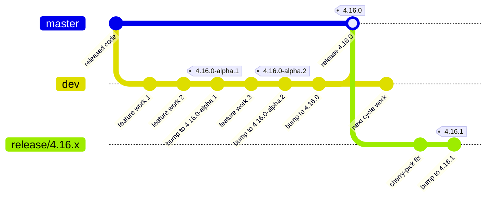

# Development and Release Flow

This document explains how code moves through Rocket.Chat Desktop, from a
feature branch to a published release. It is for anyone who contributes to
the project, not only release managers. For the exact commands that cut a
release, see `docs/release-process.md`. This document covers the shape of
the model and the reasoning behind it.

## Overview

The project uses three kinds of branches with distinct roles.

- `master` holds only released code. Every commit on it corresponds to
  something that has shipped or is about to ship.
- `dev` is where all development converges. Every feature and fix merges
  there first, and alpha releases are tagged directly from it.
- `release/X.Y.x` branches exist only after a stable version has shipped.
  They carry patches for that version. They do not pull in unrelated work
  that has since landed on `dev`.

This separation keeps `master` a stable, auditable history of what shipped.
`dev` stays free to move fast.

## Branch roles

| Branch               | Purpose                                                                             | Who merges into it                      | Merge method        |
| -------------------- | ----------------------------------------------------------------------------------- | --------------------------------------- | ------------------- |
| `dev`                | Default branch. Integration point for all feature and fix PRs. Source of alpha tags | Any contributor via PR review           | Squash              |
| `master`             | Released code only. Moves forward only through a `dev`→`master` release merge       | Release manager, at promotion time      | True merge commit   |
| `release/X.Y.x`      | Patch line for a shipped stable version. Receives cherry-picked fixes from `dev`    | Release manager, when preparing a patch | Squash              |
| Feature/fix branches | Short-lived. One change per branch. Opened against `dev`                            | The author, via PR                      | Squash (into `dev`) |

## Lifecycle of a change

A typical change follows this path:

1. A contributor branches off `dev` and opens a PR. After review, the PR is
   squash-merged into `dev`.
2. `dev` accumulates changes between releases. Periodically, a version bump
   is merged and tagged as an alpha (`X.Y.0-alpha.N`) directly on `dev`. QA
   and early adopters can then test the accumulating changes.
3. When the release is ready to ship, a last bump on `dev` drops the
   pre-release suffix. Then a release PR merges `dev` into `master` with a
   true merge commit. The stable tag (`X.Y.0`) goes on that merge commit.
4. If someone finds a defect in a shipped stable version, the fix merges
   into `dev` as usual. Then the fix is cherry-picked onto the corresponding
   `release/X.Y.x` branch and released as a patch (`X.Y.Z`). If the branch
   does not exist, create it from the `X.Y.0` tag.

```mermaid
---
config:
  gitGraph:
    mainBranchName: "master"
---
gitGraph
  commit id: "released code"
  branch dev
  checkout dev
  commit id: "feature work 1"
  commit id: "feature work 2"
  commit id: "bump to 4.16.0-alpha.1" tag: "4.16.0-alpha.1"
  commit id: "feature work 3"
  commit id: "bump to 4.16.0-alpha.2" tag: "4.16.0-alpha.2"
  commit id: "bump to 4.16.0"
  checkout master
  merge dev id: "release 4.16.0" tag: "4.16.0"
  checkout dev
  commit id: "next cycle work"
  checkout master
  branch release/4.16.x
  checkout release/4.16.x
  commit id: "cherry-pick fix"
  commit id: "bump to 4.16.1" tag: "4.16.1"
```

The diagram omits the individual squash commits that make up "feature
work". In practice, each labeled commit above is the product of one or more
squash-merged PRs.

## CI/CD

| Stage         | Trigger                                               | What happens                                                                                                                                                                                                                      |
| ------------- | ----------------------------------------------------- | --------------------------------------------------------------------------------------------------------------------------------------------------------------------------------------------------------------------------------- |
| PR checks     | Any PR opened against `dev`, `master`, or `release/*` | `validate-pr` runs lint and the full test suite. A `build-artifacts` label also builds installers for manual smoke-testing                                                                                                        |
| Release build | A semver tag push (`X.Y.Z` or `X.Y.Z-alpha.N`, etc.)  | `build-release` creates a **draft** GitHub release, then seven parallel jobs (per platform × installer family) build, sign and upload the installers into it. `workflow_dispatch` runs the same jobs as a dry run with no release |
| Publish       | Manual                                                | A human reviews the draft release and its assets, then publishes it                                                                                                                                                               |

Release builds run only on a tag and never on a branch push. This keeps
`dev`, `master`, and `release/*` free of accidental builds. It also
guarantees that nothing reaches users without both a deliberate tag and a
deliberate publish step.

The app's auto-updater receives published releases through three channels:

| Channel           | Who receives it                                                 |
| ----------------- | --------------------------------------------------------------- |
| `latest` (stable) | All users by default                                            |
| `beta`            | Users who opt into beta updates                                 |
| `alpha`           | Users who opt into alpha updates (also receive beta and stable) |

## Versioning

Versions follow semver (`MAJOR.MINOR.PATCH`, with an optional
`-alpha.N`/`-beta.N` pre-release suffix). Two conventions keep the branches
in sync:

- **The `dev` version invariant**: `package.json` on `dev` always equals
  the newest tag cut from `dev`'s own line. Right after a stable promotion,
  `dev` stays at the version that just shipped. It does not jump ahead until
  the next cycle starts.
- **Alpha numbering starts at `.1`**: the first alpha of a new cycle is
  `X.(Y+1).0-alpha.1`. It is never a bare `X.(Y+1).0`. The release process
  reserves that plain version number for the eventual stable release of
  that cycle.

## Rules that keep the model consistent

- **Never back-merge.** `master` and `release/X.Y.x` branches never merge
  back into `dev`. Two practices keep `master` a pure superset of `dev`'s
  history: bump `dev` before every promotion, and cherry-pick fixes downward
  from `dev` to patch lines. The single exception is a hotfix that someone
  authors directly on a `release/X.Y.x` branch. Forward-port it to `dev`
  immediately with a small cherry-pick PR, so that the next promotion does
  not lose it.
- **Never squash the promotion PR.** Merge the `dev`→`master` release PR
  with a true merge commit. A squash forks history permanently and makes
  every future diff between the branches unreadable.
- **Always tag through `yarn release:tag`.** The script enforces that a tag
  goes on a commit that belongs to the right branch for its channel. A bare
  `git tag` push has no such guard.

## Further reading

- `docs/release-process.md` — the operational runbook. It has the exact
  commands to cut alpha, stable, and patch releases, and the full reference
  for `yarn release:tag`.
- `.github/CONTRIBUTING.md` — the Branching Model section for contributors
  opening a PR.
