# Version Support Data Loading & Caching Architecture

## Overview

This document describes how the desktop app fetches, caches, and uses version support data from Rocket.Chat servers. The system implements smart retry logic with per-server caching to handle network issues gracefully.

**Key principle**: Block users only when we have **definitive proof** that their server version is unsupported. Allow access during data loading and when using fallback sources.

---

## State Machine Flow

The fetch process follows a state machine with 4 states:

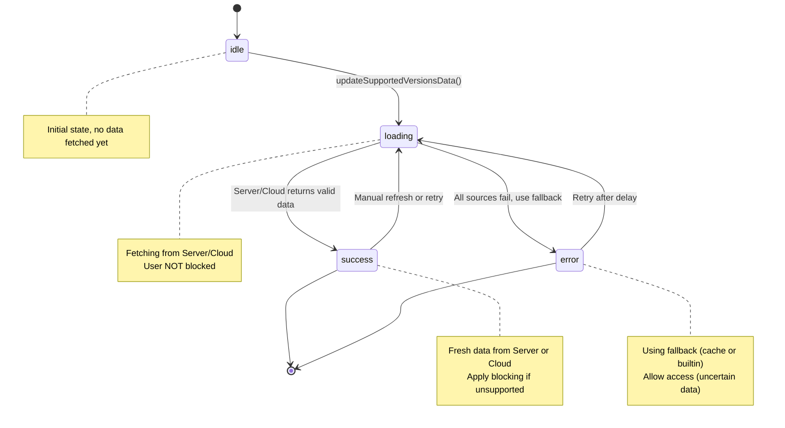

---

## Complete Fetch Sequence

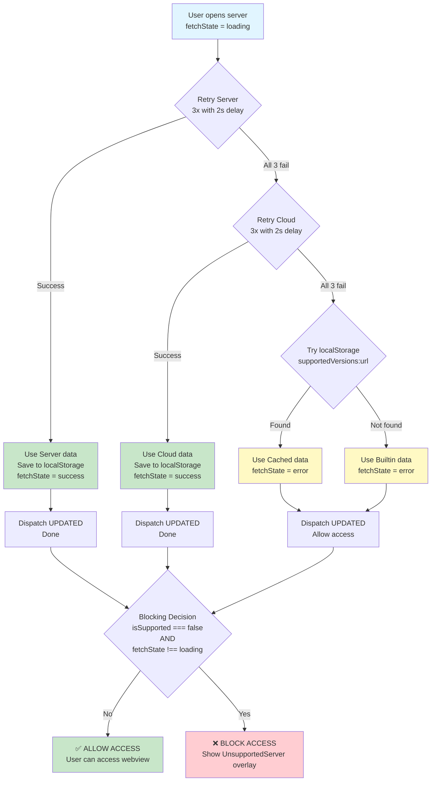

---

## Retry Logic Detail

Each source (Server and Cloud) is retried 3 times with 2-second delays:

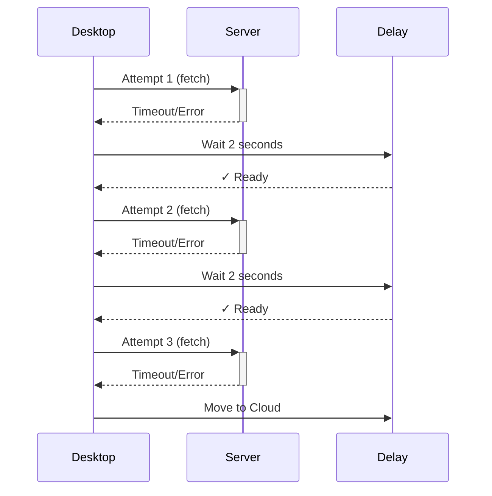

**Total wait per source**: Up to 6 seconds (3 attempts × 2s delays)

---

## Blocking Decision Logic

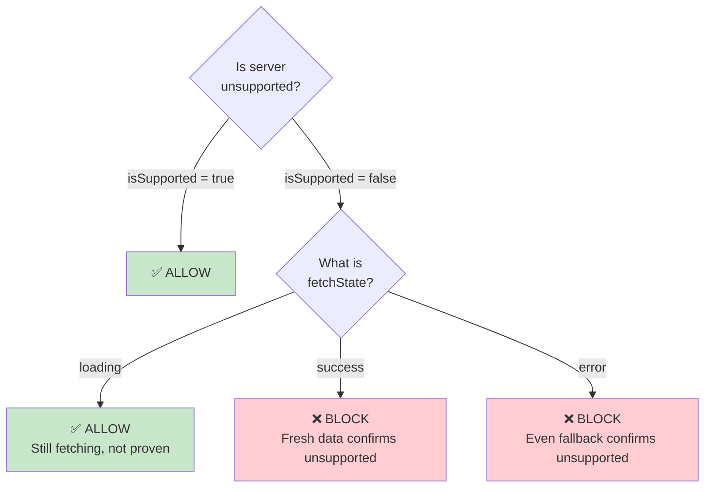

---

## Per-Server State Structure

```typescript
// Redux state for each server
{
  url: "https://chat.example.com",
  version: "7.1.0",

  // Version support data
  supportedVersionsData: SupportedVersions | undefined,
  supportedVersionsFetchState: 'idle' | 'loading' | 'success' | 'error',
  isSupportedVersion: boolean | undefined,

  // Other fields...
  title: string,
  failed: boolean,
  // ...
}

// localStorage structure (per server)
localStorage['supportedVersions:https://chat.example.com'] = {
  versions: [...],
  exceptions: {...},
  timestamp: "2024-10-31T...",
  enforcementStartDate: "2024-11-15T..."
}
```

---

## Scenario Examples

### Scenario 1: Fast Network (Server Responds)

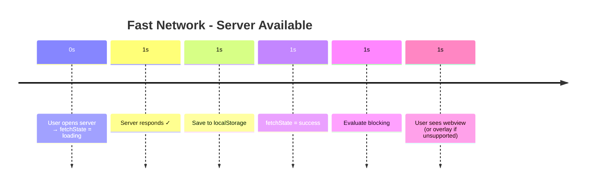

**Total time**: ~1 second

---

### Scenario 2: Slow Server + Fast Cloud

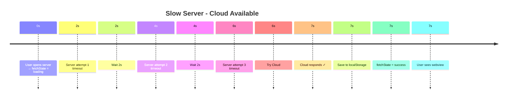

**Total time**: ~7 seconds

---

### Scenario 3: Offline with Cached Data

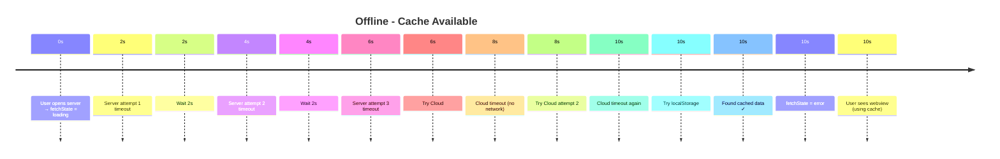

**Total time**: ~10 seconds
**Result**: User can work, using last-known-good data

---

### Scenario 4: Offline + No Cache + Builtin Blocks

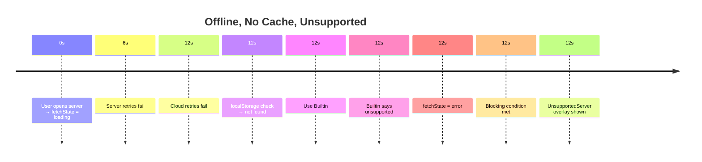

**Total time**: ~12 seconds
**Result**: User blocked (builtin confirms unsupported)

---

### Scenario 5: Airgapped Network (Server Available)

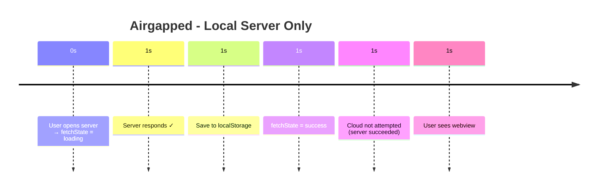

**Total time**: ~1 second
**Key**: Cloud retries skipped because Server already succeeded

---

## Data Flow Architecture

```mermaid
graph LR
    A["Update triggered<br/>(WEBVIEW_READY,<br/>manual refresh)"]

    A --> B["Dispatch<br/>LOADING"]
    B --> C["Set fetchState<br/>= loading"]

    C --> D["updateSupportedVersionsData()<br/>Start fetch sequence"]

    D --> E1["Retry Server<br/>3x with delays"]
    E1 -->|Success| F["Dispatch UPDATED<br/>fetchState = success"]
    E1 -->|Fail| E2["Retry Cloud<br/>3x with delays"]

    E2 -->|Success| F
    E2 -->|Fail| E3["Load localStorage"]

    E3 -->|Found| G["Dispatch UPDATED<br/>fetchState = error"]
    E3 -->|Not found| E4["Use Builtin<br/>always available"]
    E4 --> G

    F --> H["Update Redux state"]
    G --> H

    H --> I["Component re-renders"]
    I --> J{"Blocking<br/>condition?"}

    J -->|No| K["Show webview"]
    J -->|Yes| L["Show UnsupportedServer<br/>overlay"]

    style A fill:#e1f5ff
    style B fill:#e1f5ff
    style C fill:#e1f5ff
    style D fill:#fff3e0
    style E1 fill:#fff3e0
    style E2 fill:#fff3e0
    style E3 fill:#fff9c4
    style E4 fill:#fff9c4
    style F fill:#c8e6c9
    style G fill:#fff9c4
    style H fill:#e1f5ff
    style K fill:#c8e6c9
    style L fill:#ffcdd2
```

---

## Component Integration

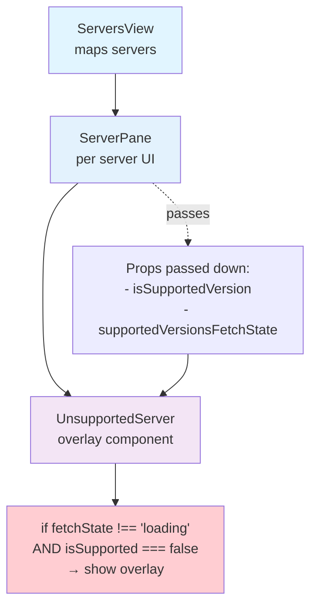

---

## Cache Management

### Storage Strategy

- **Key format**: `supportedVersions:${serverUrl}`
- **Value**: Complete `SupportedVersions` object with timestamp
- **Per-server**: Each server has its own cache entry
- **On success**: Automatically saved to localStorage
- **On failure**: Automatically loaded if available

### Lifecycle

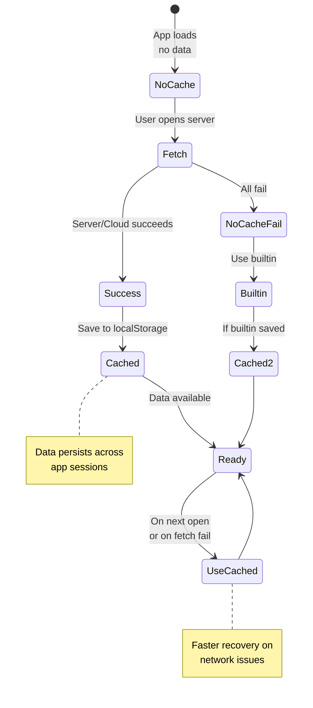

---

## Summary

| Scenario | Server | Cloud | Cache | Builtin | Result | Time |
|----------|--------|-------|-------|---------|--------|------|
| Fast network | ✓ | - | - | - | Allow/Block based on data | ~1s |
| Slow server | ✗ | ✓ | - | - | Allow/Block based on data | ~7s |
| Offline + cache | ✗ | ✗ | ✓ | - | ALLOW (uncertain) | ~10s |
| Offline + no cache | ✗ | ✗ | ✗ | ✓ | Allow/Block based on builtin | ~12s |
| Airgapped | ✓ | ✗ | - | - | Allow/Block (Cloud skipped) | ~1s |

**Key principle**: Block only on fresh `success` state. Allow on `loading` or `error` states.
