# Version Support Data Loading & Caching Architecture

## Overview

This document describes how the desktop app fetches, caches, and uses version support data from Rocket.Chat servers. The system implements smart retry logic with per-server caching to handle network issues gracefully.

**Key principle**: Block users only when we have **definitive proof** that their server version is unsupported. Allow access during data loading and when using fallback sources.

---

## State Machine Flow

The fetch process follows a state machine with 4 states:

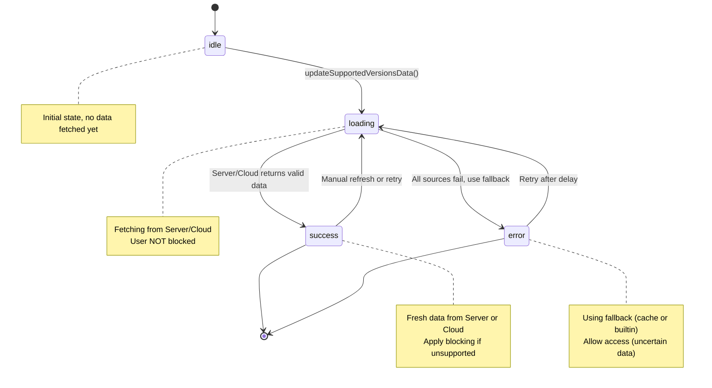

---

## Complete Fetch Sequence

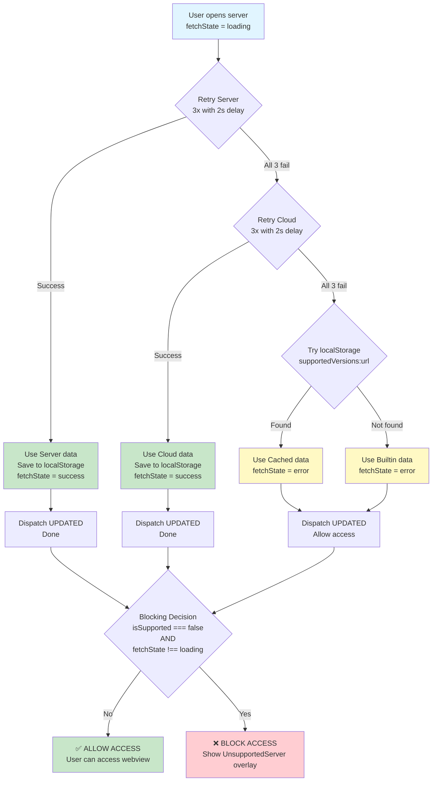

---

## Retry Logic Detail

Each source (Server and Cloud) is retried 3 times with 2-second delays:

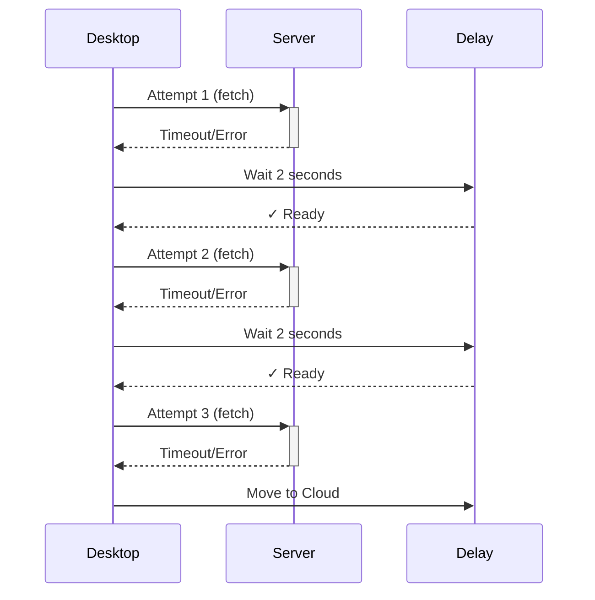

**Total wait per source**: Up to 6 seconds (3 attempts × 2s delays)

---

## Blocking Decision Logic

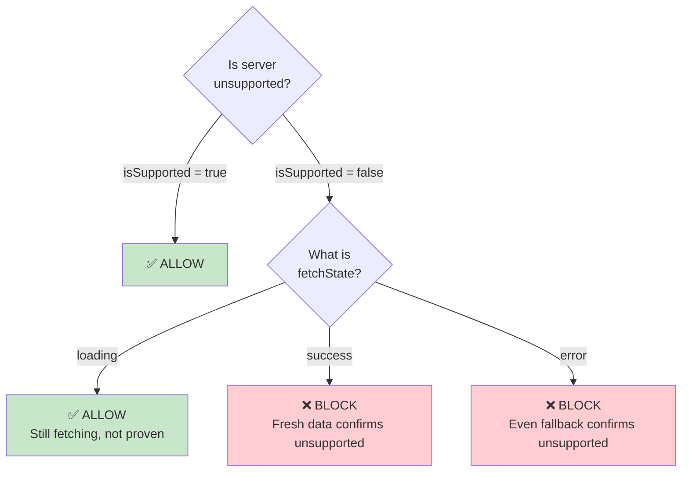

---

## Validation Throttling (30-Minute Window)

To reduce expensive validation checks on every navigation, the app implements a **30-minute throttle** on the `isServerVersionSupported()` validation logic (independent from the 12-hour dialog suppression).

### How it Works

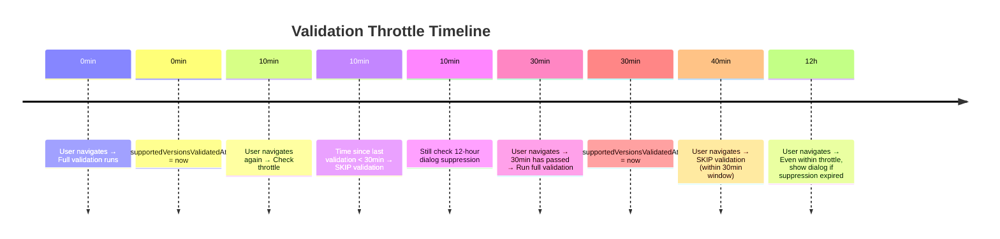

### Throttle Behavior

| Navigation | Time Since Last Validation | Action |
|-----------|---------------------------|--------|
| First load | N/A | ✅ Run full validation |
| Within 30 minutes | < 30 min | ⏸️ Skip validation, check 12h timer |
| After 30 minutes | ≥ 30 min | ✅ Run full validation again |
| Dialog showing timing | Independent | ✅ Can show if 12h passed, even within throttle |

### Benefits

- **Reduces API load**: Validation runs at most once per 30 minutes per server
- **Maintains accuracy**: Fresh check every 30 minutes ensures data isn't stale
- **Preserves warning display**: 12-hour dialog suppression works independently
- **Navigation performance**: Repeated navigation within 30 min doesn't trigger expensive checks

### When Throttle is Bypassed

- ✅ Server reload (manual or forced) - Always validates fresh
- ✅ Server switch - Different server always validates
- ✅ Dialog dismissed - Triggers fetch, resets validation timer
- ✅ App startup (WEBVIEW_READY) - Always validates first time

---

## Modal Display Logic

The version support modal (warning dialog) appears independently from the blocking overlay. It shows version expiration information and is controlled by the `fetchState`:

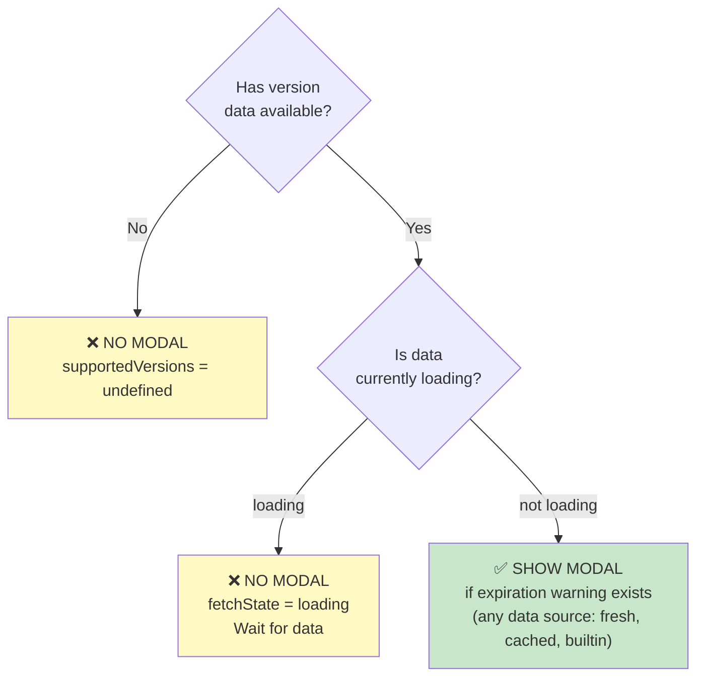

**Modal shows when**:
- `supportedVersions` data exists AND
- `fetchState !== 'loading'` (not actively fetching) AND
- 12 hours have passed since last shown (independent timer) AND
- Server version is expiring soon (has expiration message)

**Modal skips when**:
- No data available (`supportedVersions` undefined)
- Currently fetching (`fetchState === 'loading'`)
- Within 12-hour display suppression window (shows max once per 12 hours)

**Data sources that trigger modal**:
- ✅ Fresh server data (`fetchState === 'success'`)
- ✅ Fresh cloud data (`fetchState === 'success'`)
- ✅ Stale cached data (`fetchState === 'error'`)
- ✅ Generic builtin fallback (`fetchState === 'error'`)

**Key difference from blocking overlay**:
- **Overlay blocks access** - only when definitely unsupported with fresh data
- **Modal warns users** - shows expiration info from any available data, but not while actively loading
- **Modal has separate suppression** - shows max once per 12 hours independent of validation throttle

---

## Per-Server State Structure

```typescript
// Redux state for each server
{
  url: "https://chat.example.com",
  version: "7.1.0",

  // Version support data
  supportedVersionsData: SupportedVersions | undefined,
  supportedVersionsFetchState: 'idle' | 'loading' | 'success' | 'error',
  isSupportedVersion: boolean | undefined,
  supportedVersionsValidatedAt?: Date,  // Timestamp of last validation (for 30-min throttle)

  // Warning display management
  expirationMessageLastTimeShown?: Date,  // 12-hour dialog suppression timer

  // Other fields...
  title: string,
  failed: boolean,
  // ...
}

// localStorage structure (per server)
localStorage['supportedVersions:https://chat.example.com'] = {
  versions: [...],
  exceptions: {...},
  timestamp: "2024-10-31T...",
  enforcementStartDate: "2024-11-15T..."
}
```

**New field `supportedVersionsValidatedAt`**:
- Tracks when the last version validation check occurred
- Used to implement 30-minute validation throttle (see "Validation Throttling" section)
- Independent from the 12-hour dialog suppression timer

---

## Scenario Examples

### Scenario 1: Fast Network (Server Responds)

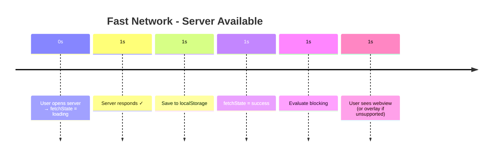

**Total time**: ~1 second

---

### Scenario 2: Slow Server + Fast Cloud

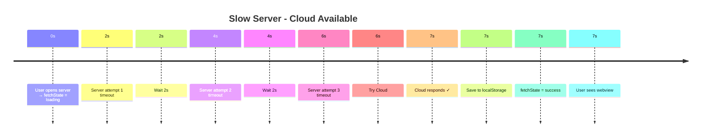

**Total time**: ~7 seconds

---

### Scenario 3: Offline with Cached Data

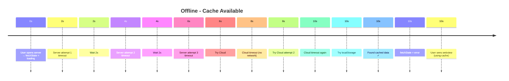

**Total time**: ~10 seconds
**Result**: User can work, using last-known-good data

---

### Scenario 4: Offline + No Cache + Builtin Blocks

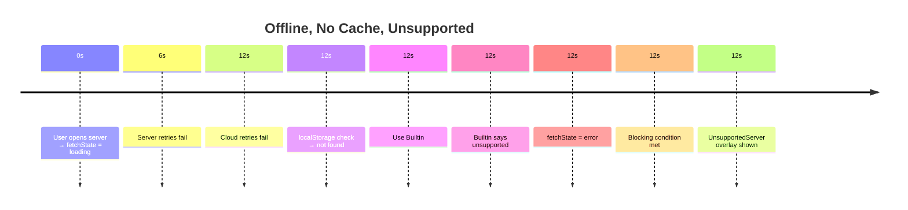

**Total time**: ~12 seconds
**Result**: User blocked (builtin confirms unsupported)

---

### Scenario 5: Airgapped Network (Server Available)

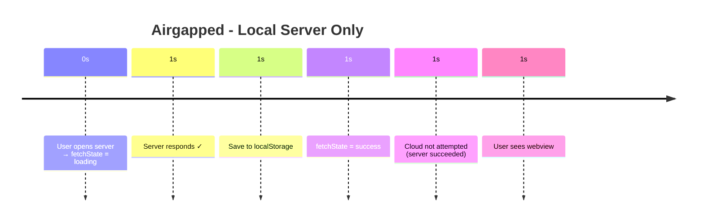

**Total time**: ~1 second
**Key**: Cloud retries skipped because Server already succeeded

---

## Data Flow Architecture

```mermaid
graph LR
    A["Update triggered<br/>(WEBVIEW_READY,<br/>manual refresh)"]

    A --> B["Dispatch<br/>LOADING"]
    B --> C["Set fetchState<br/>= loading"]

    C --> D["updateSupportedVersionsData()<br/>Start fetch sequence"]

    D --> E1["Retry Server<br/>3x with delays"]
    E1 -->|Success| F["Dispatch UPDATED<br/>fetchState = success"]
    E1 -->|Fail| E2["Retry Cloud<br/>3x with delays"]

    E2 -->|Success| F
    E2 -->|Fail| E3["Load localStorage"]

    E3 -->|Found| G["Dispatch UPDATED<br/>fetchState = error"]
    E3 -->|Not found| E4["Use Builtin<br/>always available"]
    E4 --> G

    F --> H["Update Redux state"]
    G --> H

    H --> I["Component re-renders"]
    I --> J{"Blocking<br/>condition?"}

    J -->|No| K["Show webview"]
    J -->|Yes| L["Show UnsupportedServer<br/>overlay"]

    style A fill:#e1f5ff
    style B fill:#e1f5ff
    style C fill:#e1f5ff
    style D fill:#fff3e0
    style E1 fill:#fff3e0
    style E2 fill:#fff3e0
    style E3 fill:#fff9c4
    style E4 fill:#fff9c4
    style F fill:#c8e6c9
    style G fill:#fff9c4
    style H fill:#e1f5ff
    style K fill:#c8e6c9
    style L fill:#ffcdd2
```

---

## Component Integration

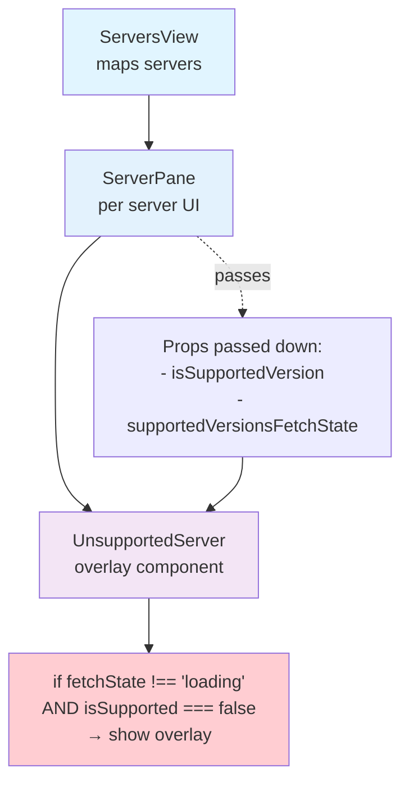

---

## URL Encoding & Cloud API Requirements

### URL Parameter Encoding

The app constructs API URLs with proper URL encoding to ensure reliable server communication:

```typescript
// Query parameter for uniqueID lookup (< v7.0.0)
// ✅ Properly encoded:
`${serverUrl}api/v1/settings.public?query=${encodeURIComponent(JSON.stringify({ _id: 'uniqueID' }))}`
// Results in: ?query=%7B%22_id%22%3A%20%22uniqueID%22%7D

// ❌ Would fail if unencoded (causes "Invalid query parameter" errors):
// `${serverUrl}api/v1/settings.public?query={"_id": "uniqueID"}`
```

**Why encoding matters**:
- Servers validate query parameters strictly
- Special characters in JSON (quotes, braces) must be URL-encoded
- Without encoding, older Rocket.Chat versions (especially v6.x) reject the request
- With proper encoding, all server versions handle it reliably

### Cloud API Domain Requirement

The Cloud API endpoint requires a valid **domain** (not IP address) to look up server-specific version policies:

```
https://releases.rocket.chat/v2/server/supportedVersions?domain={domain}&uniqueId={uniqueId}&source=desktop
```

**Domain requirement**:
- ✅ Works: `domain=chat.company.com`
- ✅ Works: `domain=ngrok-provided-url.ngrok.io` (tunneled service)
- ❌ Fails: `domain=192.168.1.100:3000` (IP addresses not recognized by Cloud API)
- ❌ Fails: `domain=192.168.1.100:3000:3620` (malformed)

**Workarounds for local/internal servers**:
1. Use a reverse proxy with domain routing (ngrok, Caddy, nginx)
2. Add DNS record pointing to the server IP
3. Configure local `/etc/hosts` entry if only for local access

**Impact when domain is unavailable**:
- Cloud API returns generic/default version policies
- Server may not be correctly identified
- Version validation uses fallback data (cache or builtin)
- May not reflect server-specific policies

---

## Cache Management

### Storage Strategy

- **Key format**: `supportedVersions:${serverUrl}`
- **Value**: Complete `SupportedVersions` object with timestamp
- **Per-server**: Each server has its own cache entry
- **On success**: Automatically saved to localStorage
- **On failure**: Automatically loaded if available

### Lifecycle

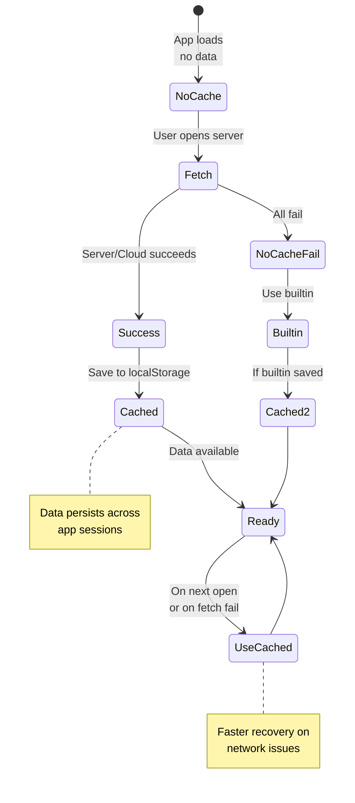

---

## Summary

### Fetch Scenarios

| Scenario | Server | Cloud | Cache | Builtin | Result | Time |
|----------|--------|-------|-------|---------|--------|------|
| Fast network | ✓ | - | - | - | Allow/Block based on data | ~1s |
| Slow server | ✗ | ✓ | - | - | Allow/Block based on data | ~7s |
| Offline + cache | ✗ | ✗ | ✓ | - | ALLOW (uncertain) | ~10s |
| Offline + no cache | ✗ | ✗ | ✗ | ✓ | Allow/Block based on builtin | ~12s |
| Airgapped | ✓ | ✗ | - | - | Allow/Block (Cloud skipped) | ~1s |

### Validation Throttle Scenarios

| Scenario | Last Validation | Time Elapsed | Action |
|----------|-----------------|--------------|--------|
| First navigation | None | N/A | ✅ Run full validation |
| Subsequent nav (quick) | 5 min ago | 5 min | ⏸️ Skip validation (within 30 min) |
| Subsequent nav (delayed) | 35 min ago | 35 min | ✅ Run validation (30 min passed) |
| Server reload | Any time | Any time | ✅ Always validate (bypass throttle) |
| Dialog dismissed | Any time | Any time | ✅ Always validate (bypass throttle) |

### Key Principles

1. **Blocking decision**: Block only on fresh `success` state with confirmed unsupported version. Allow on `loading` or `error` states.

2. **Validation throttle**: Expensive validation checks run max once per 30 minutes per server. Reduces API load while maintaining accuracy.

3. **Warning display**: Modal shows max once per 12 hours (independent of validation throttle). Can appear even within 30-minute validation window if 12 hours have passed.

4. **False positive prevention**: With proper URL encoding and Cloud API integration, supported servers no longer show false unsupported warnings due to transient failures.

5. **Fallback reliability**: Multiple fallback sources (cache, builtin) ensure users can always access servers, even in offline scenarios.
