# Video Call Screen Sharing

## Overview

This document shows how screen sharing works within an active video call in Rocket.Chat Electron.

## Cache Architecture

The screen sharing system uses a **stale-while-revalidate** caching pattern for optimal performance:

```
Desktop Capturer Cache
├── Always returns cached data immediately (instant UX)
├── If data older than 3s, triggers background refresh
├── Next request gets fresh data
└── Cache persists indefinitely (never expires)
```

**Key benefits:**
- Instant screen picker display (no loading state)
- Thumbnails stay current through background refresh
- Memory efficient (~150KB-1.4MB)
- Pre-warmed when video call loads

## Screen Sharing Flow

```mermaid
flowchart TD
    %% Pre-warming Phase (on Video Call Load)
    START[Video Call Window Loaded] --> PW1[did-finish-load Event]
    PW1 --> PW2[Trigger prewarm-capturer-cache IPC]
    PW2 --> PW3[Call refreshDesktopCapturerCache]
    PW3 --> PW4[Fetch Sources in Background]
    PW4 --> PW5[Populate Cache with Timestamp]
    PW5 --> PW6[Cache Ready for Instant Access]
    
    %% Screen Sharing Initiation
    A[Video Call Active] --> B[User Requests Screen Share]
    B --> C[Webview Calls requestScreenSharing API]
    C --> D[Preload Script Receives Request]
    
    %% IPC to Renderer
    D --> E[Send video-call-window/open-screen-picker IPC]
    E --> F[Renderer Receives Request]
    F --> G{ScreenSharePicker Mounted?}
    G -->|No| G1[Lazy Import React Module]
    G1 --> G2[Mount ScreenSharePicker Hidden]
    G -->|Yes| H[Show ScreenSharePicker]
    G2 --> H
    
    %% Stale-While-Revalidate Cache
    H --> I[Request Desktop Capturer Sources]
    I --> J{Cache Exists?}
    J -->|No| K[First Fetch - Wait for Sources]
    J -->|Yes| L[Return Cached Sources Immediately]
    
    %% Staleness Check
    L --> M{Cache Age > 3 seconds?}
    M -->|No| N[Use Fresh Cache]
    M -->|Yes| O[Trigger Background Refresh]
    O --> P[refreshDesktopCapturerCache Async]
    P --> Q[Fetch New Sources]
    Q --> R[Update Cache with New Data]
    R --> S[Next Request Gets Fresh Data]
    N --> T[Display Sources in UI]
    L --> T
    
    %% First Fetch Path
    K --> K1[Call desktopCapturer.getSources]
    K1 --> K2[System Returns Sources]
    K2 --> K3[Filter Invalid Sources]
    K3 --> K4[Cache Sources with Timestamp]
    K4 --> T
    
    %% Source Selection UI
    T --> U[Display Sources in Tabs]
    U --> V[Windows Tab - Application Windows]
    U --> W[Screens Tab - Desktop Displays]
    V --> X[User Selects Window]
    W --> Y[User Selects Screen]
    X --> Z[Validate Selected Source]
    Y --> Z
    
    %% Source Validation with Caching
    Z --> AA{Source in Validation Cache?}
    AA -->|Yes - Within 30s| AB[Return Cached Validation]
    AA -->|No| AC[Validate Source Availability]
    AC --> AD[Check Source Still Exists]
    AD --> AE{Source Valid?}
    AE -->|Yes| AF[Cache Validation 30s]
    AE -->|No| AG[Show Source Unavailable Error]
    AF --> AB
    AB --> AH[Return Source ID]
    
    %% IPC Response to Webview
    AH --> AI[Send Source ID via IPC Response]
    AI --> AJ[Preload Script Receives Source ID]
    AJ --> AK[Return Source to Webview]
    AK --> AL[Webview Gets Stream Access]
    AL --> AM[Screen Share Active]
    
    %% Error Recovery
    AG --> AN[User Selects Different Source]
    AN --> Z
    
    %% User Closes Picker Without Selecting
    H --> AO[User Closes Picker]
    AO --> AP[Hide ScreenSharePicker]
    AP --> AQ[Component Stays Mounted]
    AQ --> A
    
    %% Cache Persistence
    AM --> AR[Video Call Continues]
    AR --> AS{User Requests Screen Share Again?}
    AS -->|Yes| B
    AS -->|No| AT[Video Call Ends]
    AT --> AU[Window Closes]
    AU --> AV[Cache Persists in Memory]
    AV --> AW{App Quit or Error?}
    AW -->|Yes| AX[Clear All Caches]
    AW -->|No| AY[Cache Available for Next Call]
    
    %% Background Refresh Details
    P --> BA{Fetch Already in Progress?}
    BA -->|Yes| BB[Skip - Deduplication]
    BA -->|No| BC[Start Async Fetch]
    BC --> Q
    
    %% Styling
    classDef mainProcess fill:#e1f5fe,stroke:#0277bd,stroke-width:2px
    classDef renderer fill:#f3e5f5,stroke:#7b1fa2,stroke-width:2px
    classDef webview fill:#e8f5e8,stroke:#2e7d32,stroke-width:2px
    classDef cache fill:#e3f2fd,stroke:#1976d2,stroke-width:2px
    classDef ui fill:#fff3e0,stroke:#f57c00,stroke-width:2px
    classDef validation fill:#f3e5f5,stroke:#8e24aa,stroke-width:2px
    classDef error fill:#ffebee,stroke:#c62828,stroke-width:2px
    classDef success fill:#e8f5e8,stroke:#388e3c,stroke-width:2px
    classDef prewarm fill:#fff8e1,stroke:#ffa000,stroke-width:2px
    
    class PW2,PW3,K1,K2,K3,AI mainProcess
    class D,E,F,G,G1,G2,AJ,AK renderer
    class A,C,AL,AM,AR webview
    class I,J,K4,L,M,N,O,P,Q,R,S,BA,BB,BC,AV,AW,AX,AY cache
    class H,T,U,V,W,X,Y,AO,AP,AQ ui
    class Z,AA,AB,AC,AD,AE,AF validation
    class AG,AN error
    class AH,AL,AM success
    class START,PW1,PW2,PW3,PW4,PW5,PW6 prewarm
```



## Explanation

**What this diagram shows:**
- Cache pre-warming when video call loads
- Stale-while-revalidate pattern for instant display
- Background refresh keeping thumbnails current
- Deferred React loading for the picker component

**Key parts:**
1. **Pre-warming** - Cache populated when video call loads
2. **Instant Display** - Always returns cached data immediately
3. **Background Refresh** - Updates stale cache without blocking UI
4. **Source Selection** - Tabbed interface for windows and screens
5. **Validation** - Ensures selected source still exists
6. **Persistence** - Cache survives window close for next call

**Cache Behavior:**
- **Stale threshold**: 3 seconds
- **Validation cache**: 30 seconds
- **Expiration**: Never (persists until app quit or error)
- **Memory**: ~150KB-1.4MB

**Color Guide:**
- **Blue** - Main process operations
- **Purple** - Renderer process & Validation
- **Green** - Webview & Success states
- **Light Blue** - Cache operations
- **Orange** - User interface elements
- **Yellow** - Pre-warming phase
- **Red** - Error states

## Detailed Step-by-Step Explanation

### 1. Cache Pre-warming
When the video call webview finishes loading, the app proactively populates the cache.

**What happens:**
- `did-finish-load` event triggers pre-warming
- `video-call-window/prewarm-capturer-cache` IPC called
- `refreshDesktopCapturerCache()` fetches sources in background
- Cache populated before user ever clicks screen share
- First screen picker open shows sources instantly

### 2. Starting Screen Sharing
When you click the screen share button during a video call.

**What happens:**
- Video call website detects your click
- Calls the screen sharing API provided by the preload script
- IPC message sent to renderer process
- ScreenSharePicker component shown (or mounted if first time)

### 3. Deferred React Loading
The ScreenSharePicker React component is loaded lazily.

**What happens:**
- First screen share request triggers dynamic import
- `screenSharePickerMount.tsx` loaded asynchronously
- React component mounted and kept in DOM
- Subsequent opens just toggle visibility (instant)

### 4. Stale-While-Revalidate Cache
The core caching strategy that makes screen sharing feel instant.

**What happens:**
- Request comes in for desktop capturer sources
- **If cache exists**: Return immediately (no waiting)
- **If cache older than 3s**: Trigger background refresh
- **Background refresh**: Fetches new sources asynchronously
- **Next request**: Gets the fresh data
- **Cache never expires**: Only cleared on error or app quit

**Example flow:**
```
T=0s: User opens picker → Cache returns instantly (2s old)
T=0s: Background refresh starts (async)
T=1s: Background refresh completes, cache updated
T=5s: User opens picker again → Gets fresh data instantly
```

### 5. Source Filtering and Validation
Sources are filtered and validated before display.

**Filtering (during fetch):**
- Removes sources with empty names
- Removes sources with empty thumbnails
- Only valid sources cached

**Validation (on selection):**
- Checks if selected source still exists
- Cached for 30 seconds to avoid repeated checks
- Shows error if source no longer available

### 6. Source Selection UI
Clean tabbed interface for choosing what to share.

**What happens:**
- **Windows tab**: Shows application windows with thumbnails
- **Screens tab**: Shows connected displays
- Preview thumbnails help identify correct source
- Click to select, picker closes automatically

### 7. Cache Persistence
Cache survives beyond the video call window lifecycle.

**What happens:**
- Video call window closes
- Cache remains in memory
- Next video call benefits from existing cache
- Only cleared on:
  - Application quit
  - Explicit cleanup call
  - Fetch error (keeps last good data on error)

### 8. Promise Deduplication
Prevents multiple simultaneous fetches.

**What happens:**
- If fetch already in progress, new requests wait for it
- Single system call even with rapid requests
- Reduces CPU and memory pressure

## Why Stale-While-Revalidate?

### Previous Approach (TTL-based)
```
Cache hit within 3s → Return cached data
Cache expired → Fetch new data (blocking)
Window close → Schedule 60s cleanup timer
```

**Problems:**
- Empty state possible if cache expired
- Blocking fetch when cache expired
- Complex cleanup logic

### Current Approach (Stale-While-Revalidate)
```
Cache exists → Return immediately (always instant)
Cache stale → Background refresh (non-blocking)
Window close → Keep cache (no cleanup timer)
```

**Benefits:**
- Never shows empty/loading state
- Thumbnails stay current through background refresh
- Simpler code, better UX

## Performance Characteristics

### Response Times
| Scenario | Time |
|----------|------|
| Pre-warmed cache | ~0ms (instant) |
| Cache hit (fresh) | ~0ms (instant) |
| Cache hit (stale) | ~0ms + background refresh |
| Cold start (no cache) | ~200-500ms (initial fetch) |

### Memory Usage
| Component | Size |
|-----------|------|
| Source metadata | ~10KB |
| Thumbnails (10 sources) | ~100KB-500KB |
| Thumbnails (50 sources) | ~500KB-1.4MB |
| Validation cache | ~1KB |

### Cache Lifecycle
```
App Start
    │
    ▼
Video Call Opens
    │
    ├─► did-finish-load → Pre-warm cache
    │
    ▼
Screen Share Request
    │
    ├─► Return cached (instant)
    ├─► Background refresh if stale
    │
    ▼
Video Call Closes
    │
    ├─► Cache persists
    │
    ▼
Next Video Call
    │
    ├─► Cache still available
    │
    ▼
App Quit
    │
    └─► Cache cleared
```

## Technical Implementation

### Stale-While-Revalidate Logic
```typescript
const DESKTOP_CAPTURER_STALE_THRESHOLD = 3000;

handle('desktop-capturer-get-sources', async (_webContents, opts) => {
  const options = Array.isArray(opts) ? opts[0] : opts;

  if (desktopCapturerCache) {
    const isStale =
      Date.now() - desktopCapturerCache.timestamp >
      DESKTOP_CAPTURER_STALE_THRESHOLD;
    if (isStale && !desktopCapturerPromise) {
      refreshDesktopCapturerCache(options); // Fire and forget
    }
    return desktopCapturerCache.sources; // Always return immediately
  }

  // No cache - wait for initial fetch
  refreshDesktopCapturerCache(options);
  if (desktopCapturerPromise) {
    return await desktopCapturerPromise;
  }
  return [];
});
```

### Background Refresh Function
```typescript
const refreshDesktopCapturerCache = (options: Electron.SourcesOptions): void => {
  if (desktopCapturerPromise) return; // Deduplication

  desktopCapturerPromise = (async () => {
    try {
      const sources = await desktopCapturer.getSources(options);
      const validSources = sources.filter(/* validation logic */);
      
      desktopCapturerCache = {
        sources: validSources,
        timestamp: Date.now(),
      };
      return validSources;
    } catch (error) {
      console.error('Background cache refresh failed:', error);
      return desktopCapturerCache?.sources || []; // Keep last good data
    } finally {
      desktopCapturerPromise = null;
    }
  })();
};
```

### Pre-warming Handler
```typescript
handle('video-call-window/prewarm-capturer-cache', async () => {
  refreshDesktopCapturerCache({ types: ['window', 'screen'] });
  return { success: true };
});
```

## User Experience Benefits

### Instant Screen Picker
- Cache pre-warmed when video call loads
- First open shows sources immediately
- No loading spinner or empty state

### Current Thumbnails
- Background refresh keeps previews up-to-date
- User always sees accurate window previews
- Changes detected within 3 seconds

### Seamless Repeat Use
- Second screen share opens instantly
- Cache persists between calls
- No degradation over session length

### Reliable Selection
- 30-second validation cache prevents repeated checks
- Clear error message if source unavailable
- Easy recovery with different selection

This caching architecture ensures screen sharing is fast, reliable, and provides an excellent user experience throughout the video call session.
