# Video Call Screen Sharing

## Overview

This document shows how screen sharing works within an active video call in Rocket.Chat Electron.

## Screen Sharing Flow

```mermaid
flowchart TD
    %% Screen Sharing Initiation
    A[Video Call Active] --> B[User Requests Screen Share]
    B --> C[Webview Calls requestScreenSharing API]
    C --> D[Preload Script Receives Request]
    
    %% IPC Communication to Main Process
    D --> E[Send video-call-window/open-screen-picker IPC]
    E --> F[Main Process Receives Request]
    F --> G[Create Screen Picker Window]
    G --> H[Load ScreenSharePicker Component]
    
    %% Desktop Capturer Cache Check
    H --> I{Desktop Capturer Cache Valid?}
    I -->|Yes - Within 3s TTL| J[Return Cached Sources]
    I -->|No - Cache Expired/Empty| K[Fetch Available Sources]
    
    %% System Source Fetching
    K --> L[Call desktopCapturer.getSources]
    L --> M[System Returns Available Sources]
    M --> N[Filter & Process Sources]
    N --> O[Cache Sources with 3s TTL]
    O --> J[Return Sources to UI]
    
    %% Source Selection UI
    J --> P[Display Sources in Tabs]
    P --> Q[Windows Tab - Application Windows]
    P --> R[Screens Tab - Desktop Displays]
    Q --> S[User Selects Window]
    R --> T[User Selects Screen]
    S --> U[Validate Selected Source]
    T --> U
    
    %% Source Validation with Caching
    U --> V{Source in Validation Cache?}
    V -->|Yes - Within 30s TTL| W[Return Cached Validation]
    V -->|No - Not Cached/Expired| X[Validate Source Availability]
    X --> Y[Check Source Still Exists]
    Y --> Z{Source Valid?}
    Z -->|Yes| AA[Cache Validation with 30s TTL]
    Z -->|No| BB[Show Source Unavailable Error]
    AA --> W
    W --> CC[Return Source ID to Main Process]
    
    %% IPC Response to Webview
    CC --> DD[Send Source ID via IPC Response]
    DD --> EE[Preload Script Receives Source ID]
    EE --> FF[Return Source to Webview]
    FF --> GG[Webview Gets Stream Access]
    GG --> HH[User Sees Screen Share Active]
    
    %% Error Handling
    BB --> II[User Selects Different Source]
    II --> U
    
    %% Cache Cleanup on Window Close
    HH --> JJ[Video Call Window Closes]
    JJ --> KK[Schedule Cache Cleanup - 60s Delay]
    KK --> LL{Other Video Call Windows?}
    LL -->|Yes| MM[Keep Cache Active]
    LL -->|No| NN[Clear Desktop Capturer Cache]
    NN --> OO[Clear Source Validation Cache]
    OO --> PP[Cache Cleanup Complete]
    
    %% Cache Miss Performance Path
    K --> QQ[Background Promise Deduplication]
    QQ --> RR{Existing Fetch in Progress?}
    RR -->|Yes| SS[Wait for Existing Fetch]
    RR -->|No| TT[Start New Fetch Operation]
    SS --> J
    TT --> L
    
    %% Styling
    classDef mainProcess fill:#e1f5fe,stroke:#0277bd,stroke-width:2px
    classDef renderer fill:#f3e5f5,stroke:#7b1fa2,stroke-width:2px
    classDef webview fill:#e8f5e8,stroke:#2e7d32,stroke-width:2px
    classDef cache fill:#e3f2fd,stroke:#1976d2,stroke-width:2px
    classDef ui fill:#fff3e0,stroke:#f57c00,stroke-width:2px
    classDef validation fill:#f3e5f5,stroke:#8e24aa,stroke-width:2px
    classDef error fill:#ffebee,stroke:#c62828,stroke-width:2px
    classDef success fill:#e8f5e8,stroke:#388e3c,stroke-width:2px
    
    class F,G,L,M,N,CC,DD,KK,LL,NN,OO mainProcess
    class D,E,EE,FF renderer
    class A,C,GG,HH webview
    class I,J,O,V,W,AA,QQ,RR,SS,TT cache
    class H,P,Q,R,S,T ui
    class U,X,Y,Z,BB validation
    class BB,II error
    class CC,GG,HH,PP success
```

## Explanation

**What this diagram shows:**
- How screen sharing works inside an active video call
- The caching system that makes it fast and smooth
- How users select what to share from their computer
- Error handling when something goes wrong

**Key parts:**
1. **User Request** - User clicks screen share button in video call
2. **Source Discovery** - App finds all windows and screens available
3. **Caching System** - Remembers recent results to avoid slow lookups
4. **User Selection** - Shows windows and screens in easy-to-use tabs
5. **Validation** - Checks that selected window/screen still exists
6. **Stream Access** - Gives video call access to share the screen
7. **Cache Cleanup** - Cleans up memory when no longer needed

**Performance Features:**
- **3-second cache** for source lists (faster when user reopens picker)
- **30-second validation cache** (remembers which sources work)
- **60-second cleanup delay** (keeps cache active for quick re-use)
- **Promise deduplication** (prevents multiple slow system calls)

**Color Guide:**
- **Blue** - Main process & Cache operations
- **Purple** - Renderer process & Validation
- **Green** - Webview & Success states
- **Orange** - User interface elements
- **Red** - Error states

**Starting Point:**
This flow starts from the "Video Call Active" state that you get after completing the window management flow.

## Detailed Step-by-Step Explanation

### 1. Starting Screen Sharing
When you're in an active video call and want to share your screen, you click the screen share button in the video call interface.

**What happens:**
- The video call website detects your click on the screen share button
- It calls a special function that Rocket.Chat provides for screen sharing
- This request goes through a secure bridge between the video call and the main app
- The main app receives the screen sharing request

### 2. Opening the Source Picker
The app needs to show you what you can share (windows and screens).

**What happens:**
- Creates a new small window specifically for choosing what to share
- This picker window is separate from your video call window
- Loads a user interface that will show you all available options
- Prepares to fetch information about what's available on your computer

### 3. Checking the Cache First
Before asking your computer for available windows and screens, the app checks if it already knows.

**What happens:**
- Looks in its memory for a recent list of windows and screens
- If it found a list less than 3 seconds ago, it uses that (much faster!)
- If the information is older than 3 seconds, it needs to get fresh data
- This caching makes screen sharing feel instant when you use it multiple times

### 4. Getting Available Sources
When the cache is empty or old, the app asks your operating system what you can share.

**What happens:**
- Asks your computer for a list of all open windows
- Asks for a list of all monitors/screens you have
- Your operating system provides thumbnails and names for each option
- The app filters and organizes this information for display

### 5. Caching for Performance
To make future requests faster, the app remembers what it just learned.

**What happens:**
- Stores the list of windows and screens in memory
- Sets a 3-second expiration time on this information
- If multiple screen share requests come in quickly, they all use the same cached data
- This prevents overwhelming your computer with repeated requests

### 6. Showing Your Options
Now you see a nice interface with everything you can share.

**What happens:**
- Creates tabs to organize your options: "Windows" and "Screens"
- **Windows tab**: Shows all your open applications with preview thumbnails
- **Screens tab**: Shows each monitor/display you have connected
- Each option shows a preview image and the name of the window or screen
- You can click on any option to select it

### 7. Validating Your Choice
When you click on something to share, the app double-checks it's still available.

**What happens:**
- Checks if the window or screen you selected still exists
- Sometimes windows get closed between when the list was made and when you click
- If it checked the same source recently (within 30 seconds), it uses that cached result
- If not, it quickly verifies the source is still available

### 8. Handling Unavailable Sources
If what you selected is no longer available, the app helps you choose something else.

**What happens:**
- Shows an error message explaining the window or screen is no longer available
- The source picker stays open so you can choose a different option
- Your previous selection is cleared
- You can try selecting a different window or screen

### 9. Returning the Source
When you've successfully selected something that's available, the app provides it to your video call.

**What happens:**
- Caches the validation result for 30 seconds (in case you want to share the same thing again soon)
- Sends the source information back to the main app
- The main app passes this information to your video call
- The source picker window closes since you've made your choice

### 10. Activating Screen Sharing
Your video call now has permission to share your selected screen or window.

**What happens:**
- The video call website receives the source information
- It can now access the stream from your selected window or screen
- Other people in the call start seeing what you're sharing
- The screen sharing is now active and working

### 11. Cache Cleanup
When you close your video call, the app cleans up the memory it was using.

**What happens:**
- Waits 60 seconds after the video call window closes (in case you open another call quickly)
- Checks if any other video call windows are still open
- If no other video calls are running, it clears all cached screen sharing data
- This prevents the app from using memory unnecessarily

### 12. Performance Optimization
The app has special features to make screen sharing as fast as possible.

**What happens:**
- **Promise deduplication**: If multiple requests come in at the same time, it only asks the system once
- **Background processing**: Fetching source information happens in the background
- **Smart caching**: Keeps frequently used information readily available
- **Efficient cleanup**: Only clears memory when it's actually not needed

## Why This System Works Well

### Speed and Responsiveness
- **3-second source cache**: Makes the picker open almost instantly on repeat use
- **30-second validation cache**: Avoids re-checking the same sources repeatedly
- **Immediate response**: You see your options as quickly as your computer can provide them
- **Background optimization**: Multiple requests don't slow each other down

### Reliability
- **Real-time validation**: Ensures what you select actually works
- **Error recovery**: Helps you choose something else if your first choice isn't available
- **Source verification**: Double-checks everything before committing
- **Graceful degradation**: Still works even if some features are slow

### Resource Management
- **Smart caching**: Only keeps information as long as it's useful
- **Memory cleanup**: Automatically frees up memory when not needed
- **Efficient requests**: Doesn't overwhelm your computer with repeated system calls
- **Multi-window support**: Handles multiple video calls without conflicts

### User Experience
- **Visual previews**: See exactly what you'll be sharing before you choose
- **Organized tabs**: Easy to find windows vs. screens
- **Clear feedback**: Know immediately if something isn't available
- **Fast response**: Screen sharing starts quickly once you make a choice

This system ensures that screen sharing is fast, reliable, and doesn't slow down your computer, even when you have many windows open or multiple monitors connected. 