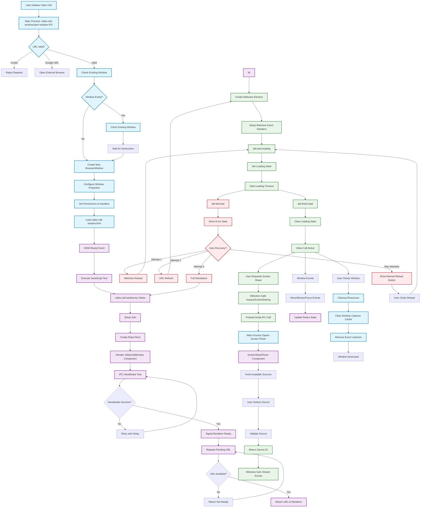

# Video Call Window Flow Documentation

## Overview

The Rocket.Chat Electron app includes a video call window system that creates a separate browser window for video conferencing. This document outlines the complete flow from initiation to cleanup.

## Architecture Components

### Main Process Components
- **IPC Handler** (`src/videoCallWindow/ipc.ts`) - Manages window creation and IPC communication
- **Window Management** - Handles BrowserWindow lifecycle and configuration
- **Desktop Capturer** - Provides screen sharing capabilities with caching

### Renderer Process Components
- **Bootstrap Script** (`src/videoCallWindow/video-call-window.tsx`) - Initializes the React app
- **VideoCallWindow Component** (`src/videoCallWindow/videoCallWindow.tsx`) - Main React component
- **ScreenSharePicker** (`src/videoCallWindow/screenSharePicker.tsx`) - Screen sharing interface

### Webview Process
- **Preload Script** (`src/videoCallWindow/preload/index.ts`) - Exposes APIs to webview content
- **Jitsi Bridge** - Handles video call platform integration

## Complete Flow Diagram



## Detailed Flow Breakdown

### 1. Initiation Phase
- User triggers video call from main Rocket.Chat window
- Main process receives `video-call-window/open-window` IPC call with URL
- URL validation ensures only HTTP/HTTPS protocols are allowed
- Google URLs are redirected to external browser to prevent conflicts

### 2. Window Management
- Checks if existing video call window exists
- If exists, properly closes and waits for destruction to complete
- Creates new BrowserWindow with optimized settings for video calls
- Configures security settings and permission handlers

### 3. Renderer Initialization
- Loads `video-call-window.html` template
- Executes JavaScript initialization test
- Sets up i18n for localization
- Creates React root and renders main component

### 4. IPC Handshake & URL Request
- Performs handshake test to ensure IPC communication works
- Retries with exponential backoff if handshake fails
- Signals renderer ready state to main process
- **Renderer requests pending URL from main process (pull-based)**
- Main process returns URL if available, or signals to retry

### 5. Webview Creation
- Creates webview element with video call URL
- Sets up event handlers for loading states
- Configures preload script for API exposure
- Implements loading timeout with auto-recovery

### 6. Error Handling & Recovery
The system includes a multi-tier recovery system:

#### Automatic Recovery Strategies
1. **Webview Reload** (1s delay) - Simple webview refresh
2. **URL Refresh** (2s delay) - Clears webview and reloads URL
3. **Full Reinitialize** (3s delay) - Reloads entire window

#### Fallback Mechanisms
- Loading timeout (15 seconds) triggers auto-recovery
- Maximum 3 automatic recovery attempts
- Manual reload button if auto-recovery fails
- Silent auto-recovery attempts with increasing delays

### 7. Screen Sharing Integration
- Webview content requests screen sharing via exposed API
- Preload script handles IPC communication
- Main process opens ScreenSharePicker component
- User selects from available windows/screens
- Desktop capturer validates source availability
- Source ID returned to webview for stream access

### 8. Performance Optimizations
- **Desktop Capturer Caching** - 3-second TTL for source lists
- **Source Validation Caching** - 30-second TTL for source validity
- **Lazy Cache Cleanup** - 60-second delay after window close
- **Background Throttling** - Enabled for better performance
- **V8 Cache Optimization** - Bypass heat check for faster startup

### 9. Window Lifecycle Management
- State persistence for window position/size
- Event handlers for focus, resize, move events
- Redux state updates for UI synchronization
- Proper cleanup of resources on window close

## Key Features

### Robust Error Handling
- Multiple recovery strategies for different failure modes
- Complete logging for debugging
- Graceful degradation when resources unavailable

### Security Measures
- URL validation and protocol restrictions
- Permission request handling for media access
- Context isolation for webview content
- SMB protocol blocking for security

### Low-Spec Machine Support
- Optimized for performance on limited hardware
- Background throttling and memory management
- Efficient caching strategies
- Fallback recovery mechanisms

### Pull-Based URL Handling
- **Prevents Lost Calls** - Renderer actively requests URL instead of waiting for push
- **Race Condition Immunity** - No timing dependencies between processes
- **Retry Mechanism** - Built-in retry logic if URL not yet available
- **Consistent Pattern** - Matches screen sharing request/response pattern
- **Better Error Handling** - Clear success/failure responses for troubleshooting

### IPC Acknowledgment Patterns
- **All Communications Use invoke/handle** - No fire-and-forget send() calls
- **Proper Response Validation** - Every IPC call checks for success acknowledgment
- **Error Detection** - Failed acknowledgments are logged for debugging
- **Event-Based Communication** - Custom events for renderer-to-component communication
- **Reliable State Tracking** - Main process confirms receipt of all lifecycle events

## File Structure

```
src/videoCallWindow/
├── ipc.ts                    # Main process IPC handlers
├── video-call-window.tsx     # Renderer bootstrap script
├── videoCallWindow.tsx       # Main React component
├── screenSharePicker.tsx     # Screen sharing UI
└── preload/
    ├── index.ts             # Webview preload script
    └── jitsiBridge.ts       # Video platform integration
```

## How to Display on GitHub

This diagram will be automatically rendered on GitHub when viewing this markdown file. GitHub natively supports Mermaid diagrams in markdown files using the ```mermaid code block syntax.

### Best Practices for GitHub Visibility:

1. **Place in docs/ folder** - This ensures the documentation is easily discoverable
2. **Link from README.md** - Add a reference to this flow documentation
3. **Use descriptive filename** - `video-call-window-flow.md` clearly indicates the content
4. **Include in PR descriptions** - Reference this diagram when making video call related changes

### Alternative Display Options:

1. **GitHub Issues/PRs** - Copy the mermaid code block directly
2. **GitHub Wiki** - Create a dedicated wiki page for architecture docs
3. **README sections** - Include simplified version in main README
4. **GitHub Pages** - Host as part of project documentation site

## Troubleshooting

### Common Issues
- **IPC Handshake Failures** - Usually resolved by retry mechanism
- **Webview Loading Timeouts** - Auto-recovery handles most cases
- **Screen Sharing Permission Denied** - System-level permissions required
- **Window Creation Failures** - Check available memory and screen bounds

### Debug Tools
- **Console Logs** - Complete logging throughout the flow
- **Developer Tools** - Auto-open available for debugging
- **State Inspection** - Redux state shows window status
- **Performance Monitoring** - Built-in stats and metrics 