# Video Call Window Management

## Overview

This document shows how the video call window is created and managed in Rocket.Chat Electron.

## Window Management Flow

```mermaid
flowchart TD
    %% Main Process Entry Point
    A[User Initiates Video Call] --> B[Main Process: video-call-window/open-window IPC]
    
    %% URL Validation
    B --> C{URL Valid?}
    C -->|Invalid| C1[Reject Request]
    C -->|Google URL| C2[Open External Browser]
    C -->|Valid| D[Check Existing Window]
    
    %% Window Management
    D --> E{Window Exists?}
    E -->|Yes| F[Close Existing Window]
    E -->|No| G[Create New BrowserWindow]
    F --> F1[Wait for Destruction] 
    F1 --> G
    
    %% Window Creation
    G --> H[Configure Window Properties]
    H --> I[Set Permissions & Handlers]
    I --> J[Load video-call-window.html]
    
    %% Renderer Process Initialization
    J --> K[DOM Ready Event]
    K --> L[Execute JavaScript Test]
    L --> M[video-call-window.ts Starts]
    
    %% React App Bootstrap
    M --> N[Setup i18n]
    N --> O[Create React Root]
    O --> P[Render VideoCallWindow Component]
    
    %% IPC Handshake with Retry & ACK
    P --> Q[IPC Handshake Test with invokeWithRetry]
    Q --> R{Handshake Success?}
    R -->|No| R1[Retry with 1s Delay - 3 attempts]
    R1 --> R2{Max Attempts?}
    R2 -->|No| Q
    R2 -->|Yes| R3[Show Fallback UI]
    R -->|Yes| S[Signal Renderer Ready with invokeWithRetry]
    
    %% URL Request with Immediate Retry & ACK
    S --> T[Request Pending URL with invokeWithRetry]
    T --> T1{URL Request Success?}
    T1 -->|IPC Error| T2[URL Retry 1s Delay - 3 attempts]
    T2 --> T3{URL Retry Attempts Left?}
    T3 -->|Yes| T
    T3 -->|No| T4[Fall Back to Full Retry]
    T4 --> R1
    T1 -->|No URL Yet| T5[URL Not Ready - Retry]
    T5 --> T3
    T1 -->|Success| V[Dispatch URL Event]
    
    %% Component URL Reception with ACK
    V --> W[VideoCallWindow Receives URL Event]
    W --> W1[Send URL Received Confirmation with invokeWithRetry]
    W1 --> X[Create Webview Element]
    X --> Y[Setup Webview Event Handlers]
    
    %% Webview Loading States with Smart Loading Control
    Y --> Z[did-start-loading]
    Z --> Z1{Initial Load Complete?}
    Z1 -->|No| AA[Set Loading State & Hide Webview]
    Z1 -->|Yes - Navigation| AA2[Skip Loading UI - Internal Navigation]
    AA --> AA1[Send Webview Loading State with invokeWithRetry]
    AA1 --> BB[Start Loading Timeout]
    AA2 --> BB2[Continue Without Loading UI]
    
    %% Success Path with Loading State Tracking
    BB --> CC[did-finish-load]
    BB2 --> CC
    CC --> DD[Clear Loading State & Show Webview]
    DD --> DD0[Mark Initial Load Complete]
    DD0 --> DD1[Send Webview Ready State with invokeWithRetry]
    DD1 --> DD2[Send Webview Created State with invokeWithRetry]
    DD2 --> DD3{Auto-open DevTools?}
    DD3 -->|Yes| DD4[Open DevTools with invokeWithRetry]
    DD3 -->|No| EE[Video Call Active]
    DD4 --> EE
    
    %% Enhanced Error Handling with Smart Delays
    BB --> FF[did-fail-load OR Timeout OR Crash]
    FF --> FF0{404-like Error?}
    FF0 -->|Yes| FF2[Extended 1500ms Delay]
    FF0 -->|No| FF3[Standard 800ms Delay]
    FF2 --> FF1[Send Webview Failed State with invokeWithRetry]
    FF3 --> FF1
    FF1 --> GG[Show Error State]
    GG --> HH{Recovery Attempt?}
    HH -->|Attempt 1| II[Webview Reload - 1s Delay - Reset Initial Load]
    HH -->|Attempt 2| JJ[URL Refresh - 2s Delay - Reset Initial Load]
    HH -->|Attempt 3| KK[Full Reinitialize - 3s Delay - Reset Initial Load]
    HH -->|Max Attempts| LL[Show Manual Reload Button]
    
    %% Window Lifecycle
    EE --> WW[Window Events]
    WW --> XX[Move/Resize/Focus Events]
    XX --> YY[Update Redux State]
    
    %% Cleanup
    EE --> ZZ[User Closes Window]
    ZZ --> ZZ1[Send Close Request with invokeWithRetry]
    ZZ1 --> AAA[Cleanup Resources]
    AAA --> BBB[Remove Event Listeners]
    BBB --> CCC[Window Destroyed]
    
    %% Recovery Flows (Allow Loading UI)
    II --> Z
    JJ --> X
    KK --> M
    
    %% Manual Recovery (Reset Initial Load State)
    LL --> DDD1[User Clicks Reload]
    DDD1 --> DDD2[Reset Initial Load State]
    DDD2 --> Z
    
    %% Styling
    classDef mainProcess fill:#e1f5fe,stroke:#0277bd,stroke-width:2px
    classDef renderer fill:#f3e5f5,stroke:#7b1fa2,stroke-width:2px
    classDef webview fill:#e8f5e8,stroke:#2e7d32,stroke-width:2px
    classDef error fill:#ffebee,stroke:#c62828,stroke-width:2px
    classDef success fill:#e8f5e8,stroke:#388e3c,stroke-width:2px
    classDef retry fill:#fff3e0,stroke:#f57c00,stroke-width:2px
    classDef ack fill:#f1f8e9,stroke:#689f38,stroke-width:2px
    
    class A,B,C,D,E,F,G,H,I,J,AAA,BBB,CCC mainProcess
    class K,L,M,N,O,P,Q,S,T,V,W,YY renderer
    class X,Y,Z,AA,BB,CC,DD,EE,WW,XX webview
    class FF,GG,HH,II,JJ,KK,LL error
    class DD,EE success
    class R1,R2,T2,T3,T4,T5 retry
    class W1,AA1,DD1,DD2,DD4,FF1,ZZ1 ack
```



## Explanation

**What this diagram shows:**
- How a video call window is created from start to finish
- The communication between different parts of the app
- How errors are handled and recovered from
- The retry system that makes it reliable

**Key parts:**
1. **URL Validation** - Makes sure the video call URL is safe to use
2. **Window Creation** - Sets up a new browser window for the video call
3. **Renderer Setup** - Prepares the user interface inside the window
4. **IPC Communication** - Secure communication between different parts
5. **Webview Loading** - Loads the actual video call website
6. **Error Recovery** - Automatically fixes problems when they happen
7. **Window Cleanup** - Properly closes everything when done

**Color Guide:**
- **Blue** - Main process (core app)
- **Purple** - Renderer process (user interface)
- **Green** - Webview (video call content) & Success states
- **Red** - Error states
- **Orange** - Retry attempts
- **Light Green** - Acknowledgment confirmations

**End Result:**
When this flow completes successfully, you get to "Video Call Active" state where the user can make video calls and use features like screen sharing.

## Detailed Step-by-Step Explanation

### 1. Starting a Video Call
When you click a video call button in Rocket.Chat, the app needs to open a special window just for the video call. This keeps your video call separate from your main chat window.

**What happens:**
- The main app receives your request with the video call URL
- It checks if the URL is safe to use (only allows https:// and http://)
- If you try to join a Google Meet, it opens in your regular browser instead
- If everything looks good, it moves to the next step

### 2. Managing Windows
The app makes sure you only have one video call window open at a time.

**What happens:**
- Checks if you already have a video call window open
- If yes, it carefully closes the old one first
- Then creates a brand new window specifically for video calls
- The window is set up with special settings for video calls

### 3. Setting Up the Window
The new window needs to be configured properly before it can show video calls.

**What happens:**
- Sets the window size and position
- Gives it permission to use your camera and microphone
- Loads the basic HTML page that will contain the video call
- Starts preparing the user interface

### 4. Loading the Interface
Inside the window, the app builds the user interface you'll interact with.

**What happens:**
- Waits for the page to fully load
- Tests that everything is working properly
- Sets up language support (so buttons show in your language)
- Creates the React interface that manages the video call

### 5. Communication Testing
Before showing you anything, the app makes sure all parts can talk to each other properly.

**What happens:**
- Tests the connection between the window and main app
- If the test fails, it tries again up to 3 times (with 1 second between tries)
- If it still fails after 3 tries, it shows you an error message
- If successful, it tells the main app "I'm ready for the video call URL"

### 6. Getting the Video Call URL
Now the window asks the main app for the actual video call URL.

**What happens:**
- Requests the URL that was saved when you clicked the video call button
- If the URL isn't ready yet, it waits and tries again (up to 3 times)
- If there's a communication problem, it retries with 1 second delays
- Once it gets the URL, it confirms receipt with the main app

### 7. Loading the Video Call
With the URL in hand, the window can now load the actual video call website using smart loading controls.

**What happens:**
- Creates a special web area (webview) inside the window, initially hidden
- Sets up monitoring for loading events
- Checks if this is the initial load or subsequent navigation
- **For initial load**: Shows loading UI and tells main app "I'm starting to load"
- **For navigation within call**: Skips loading UI to prevent interruption
- Starts a 15-second timer in case loading takes too long

### 8. Success Path
When everything loads correctly, you get your working video call.

**What happens:**
- The video call website finishes loading
- The webview becomes visible (no more 404 flicker)
- The system marks "initial load complete" to prevent future loading screens
- The window tells the main app "Video call is ready"
- If developer tools are enabled, they open automatically
- You now see the working video call interface
- The window is ready for you to make calls and share your screen
- **Important**: Subsequent navigations within the call won't show loading screens

### 9. Enhanced Error Handling
If something goes wrong, the app tries to fix it automatically with smart error detection.

**What happens:**
- **Error detection**: Identifies 404-like errors (-6, -105, -106) vs other errors
- **Smart delays**: 404 errors wait 1500ms, other errors wait 800ms before showing
- **First attempt**: Simple refresh of the video call (1 second delay, resets loading state)
- **Second attempt**: Clear everything and reload the URL (2 second delay, resets loading state)  
- **Third attempt**: Restart the entire window (3 second delay, resets loading state)
- **Final fallback**: Show you a manual reload button if all else fails
- **Recovery benefit**: Manual and auto-recovery properly reset loading state to allow loading UI

### 10. Window Management
While your video call is active, the window stays responsive and updated.

**What happens:**
- Tracks when you move or resize the window
- Remembers your preferences for next time
- Updates the main app about the window's status
- Handles focus and visibility changes

### 11. Closing the Video Call
When you're done with your call, everything gets cleaned up properly.

**What happens:**
- You close the video call window
- The window asks the main app "Is it okay to close?"
- All resources and memory are cleaned up
- Event listeners are removed to prevent memory leaks
- The window is completely destroyed

## Key Features That Make It Reliable

### Smart Loading System ✨ *New*
- **Initial load tracking**: Distinguishes first load from internal navigations
- **No flicker loading**: Webview hidden during loading to prevent 404 flashes
- **Provider optimization**: Works seamlessly with Pexip and Jitsi
- **Navigation intelligence**: Subsequent page changes don't show loading screens
- **Error-specific delays**: 404 errors get longer delays to reduce false positives

### Retry System
- **Multiple attempts**: If something fails, it tries again automatically
- **Smart delays**: Waits longer between retries to give slow systems time
- **Different strategies**: Uses different fix approaches for different problems
- **User control**: Gives you manual options if automatic fixes don't work
- **State reset**: Recovery attempts properly reset loading state for clean retries

### Communication Safety
- **Acknowledgments**: Every message between parts gets confirmed
- **Error detection**: Knows when communication fails and can react
- **Timeout protection**: Won't wait forever if something stops responding
- **Fallback options**: Always has a backup plan when things go wrong

### Performance Features
- **Fast startup**: Uses special settings to load quickly
- **Memory efficiency**: Cleans up properly to avoid slowing down your computer
- **Background throttling**: Uses less CPU when the window is hidden
- **Smart validation**: Only allows safe URLs to protect your security
- **Smooth experience**: No loading interruptions during active video calls

This system ensures that your video calls start reliably, even on slower computers or with unstable internet connections.

## Recent Loading System Improvements

### Problem-Solution Overview

The video call loading system was recently improved to solve critical user experience issues:

**Problems Solved:**
- ❌ Loading screens blocking active Pexip video calls during room transitions
- ❌ 404 flicker visible during initial load before content appears
- ❌ Users thinking calls were broken when loading screens appeared mid-call
- ❌ Poor experience with providers that do internal page navigation

**Solutions Implemented:**
- ✅ **Smart Initial Load Tracking**: Only shows loading UI for the first load, not subsequent navigations
- ✅ **Webview Visibility Control**: Hides webview during loading to prevent 404 flicker
- ✅ **Enhanced Error Handling**: Longer delays for 404-like errors, better provider compatibility
- ✅ **Recovery State Management**: Proper loading state reset during error recovery

### Technical Implementation

**Initial Load State Tracking:**
```typescript
// New state to track when initial load completes
const [hasInitialLoadCompleted, setHasInitialLoadCompleted] = useState(false);

// Only show loading for initial load, not subsequent navigations  
if (hasInitialLoadCompleted && !isReloading && recoveryAttempt === 0) {
  // Skip loading UI - this is navigation within the video call
  return;
}
```

**Webview Visibility Control:**
```typescript
// Hide webview during any loading state to prevent flicker
style={{
  display: showError || showLoading || isLoading ? 'none' : 'flex'
}}
```

**Smart Error Delays:**
```typescript
// Different delays for different error types
const ERROR_SHOW_DELAY = 800; // Regular errors
const ERROR_SHOW_DELAY_404 = 1500; // 404-like errors (more time to resolve)

// Error codes: -6 = ERR_FILE_NOT_FOUND, -105 = ERR_NAME_NOT_RESOLVED, -106 = ERR_INTERNET_DISCONNECTED
const is404LikeError = [-6, -105, -106].includes(event.errorCode);
const errorDelay = is404LikeError ? ERROR_SHOW_DELAY_404 : ERROR_SHOW_DELAY;
```

### Provider-Specific Benefits

**Pexip Video Calls:**
- Initial join shows loading screen normally
- Room transitions, lobby pages, and call setup navigation happen without loading interruption
- Users can hear audio and see video without loading overlays blocking the interface

**Jitsi Meetings:**
- No more 404 flicker during the redirect from meeting URL to actual room
- Smooth transition from meeting link to active call interface
- Better handling of authentication flows

### Testing the Improvements

**Successful Flow Test:**
1. Join a Pexip video call from Rocket.Chat
2. Verify loading screen appears only during initial connection
3. Confirm no loading screens during room transitions or feature usage
4. Test screen sharing, camera controls work without loading interruptions

**Error Handling Test:**
1. Try joining an invalid/broken video call URL
2. Verify error screen appears after appropriate delay (800ms or 1500ms)
3. Test manual reload resets loading state properly
4. Confirm auto-recovery attempts work correctly

**Provider Compatibility:**
- ✅ Pexip: Smooth room transitions without loading interruption
- ✅ Jitsi: No 404 flicker during room setup

This improved loading system maintains all existing reliability features while providing a much smoother, more professional video calling experience. 