# Video Call Window Management

## Overview

This document shows how the video call window is created and managed in Rocket.Chat Electron.

## Architecture

The video call window uses a **vanilla JavaScript bootstrap** architecture for optimal performance:

```text
video-call-window.ts (Vanilla JS)
├── i18n initialization
├── Webview creation and lifecycle management
├── Loading/error overlays (vanilla DOM manipulation)
└── Deferred React import for ScreenSharePicker only
```

**Key benefits:**
- Faster initial load (no React bundle required for core functionality)
- Simpler error recovery (direct DOM manipulation)
- React only loaded when screen sharing is needed
- Reduced memory footprint

## Window Management Flow

```mermaid
flowchart TD
    %% Main Process Entry Point
    A[User Initiates Video Call] --> B[Main Process: video-call-window/open-window IPC]
    
    %% URL Validation
    B --> C{URL Valid?}
    C -->|Invalid| C1[Reject Request]
    C -->|Google URL| C2[Open External Browser]
    C -->|Valid| D[Check Existing Window]
    
    %% Window Management
    D --> E{Window Exists?}
    E -->|Yes| F[Close Existing Window]
    E -->|No| G[Create New BrowserWindow]
    F --> F1[Wait for Destruction] 
    F1 --> G
    
    %% Window Creation
    G --> H[Configure Window Properties]
    H --> I[Set Permissions & Handlers]
    I --> J[Load video-call-window.html]
    
    %% Renderer Process - Vanilla JS Bootstrap
    J --> K[DOM Ready Event]
    K --> L[Execute JavaScript Test]
    L --> M[video-call-window.ts Starts]
    
    %% Vanilla JS Initialization
    M --> N[Initialize i18n]
    N --> O[Show Loading Overlay]
    O --> P[IPC Handshake with invokeWithRetry]
    
    %% IPC Handshake with Retry
    P --> Q{Handshake Success?}
    Q -->|No| Q1[Retry with 1s Delay - 3 attempts]
    Q1 --> Q2{Max Attempts?}
    Q2 -->|No| P
    Q2 -->|Yes| Q3[Show Fallback UI]
    Q -->|Yes| R[Signal Renderer Ready]
    
    %% URL Request
    R --> S[Request Pending URL with invokeWithRetry]
    S --> S1{URL Request Success?}
    S1 -->|IPC Error| S2[URL Retry 1s Delay - 3 attempts]
    S2 --> S3{URL Retry Attempts Left?}
    S3 -->|Yes| S
    S3 -->|No| S4[Fall Back to Full Retry]
    S4 --> Q1
    S1 -->|No URL Yet| S5[URL Not Ready - Retry]
    S5 --> S3
    S1 -->|Success| T[Create Webview Element]
    
    %% Webview Creation - Vanilla JS
    T --> U[Set Webview Attributes]
    U --> U1[preload, partition, webpreferences]
    U1 --> U2[Set src URL - Triggers Loading]
    U2 --> V[Setup Webview Event Handlers]
    
    %% Webview Loading States
    V --> W[did-start-loading]
    W --> W1{Initial Load Complete?}
    W1 -->|No| X[Update Loading Overlay Text]
    W1 -->|Yes - Navigation| X2[Skip Loading UI - Internal Navigation]
    X --> X1[Start Loading Timeout 15s]
    X2 --> Y1[Continue Without Loading UI]
    
    %% Success Path
    X1 --> Y[did-finish-load]
    Y1 --> Y
    Y --> Z[Hide Loading Overlay]
    Z --> Z1[Show Webview]
    Z1 --> Z2[Mark Initial Load Complete]
    Z2 --> Z3[Pre-warm Desktop Capturer Cache]
    Z3 --> Z4[Preload ScreenSharePicker React Component]
    Z4 --> Z5{Auto-open DevTools?}
    Z5 -->|Yes| Z6[Open DevTools]
    Z5 -->|No| AA[Video Call Active]
    Z6 --> AA
    
    %% Error Handling
    X1 --> BB[did-fail-load OR Timeout OR Crash]
    BB --> BB0{404-like Error?}
    BB0 -->|Yes| BB1[Extended 1500ms Delay]
    BB0 -->|No| BB2[Standard 800ms Delay]
    BB1 --> CC[Show Error Overlay]
    BB2 --> CC
    CC --> DD{Recovery Attempt?}
    DD -->|Attempt 1| EE[Webview Reload - 1s Delay]
    DD -->|Attempt 2| FF[URL Refresh - 2s Delay]
    DD -->|Attempt 3| GG[Full Reinitialize - 3s Delay]
    DD -->|Max Attempts| HH[Show Manual Reload Button]
    
    %% Window Lifecycle
    AA --> II[Window Events]
    II --> JJ[Move/Resize/Focus Events]
    JJ --> KK[Update Redux State]
    
    %% Screen Sharing - Deferred React
    AA --> LL[User Requests Screen Share]
    LL --> MM[IPC: video-call-window/open-screen-picker]
    MM --> NN{ScreenSharePicker Mounted?}
    NN -->|No| OO[Lazy Import screenSharePickerMount]
    OO --> PP[Mount React ScreenSharePicker]
    NN -->|Yes| QQ[Show ScreenSharePicker]
    PP --> QQ
    QQ --> RR[User Selects Source]
    RR --> SS[Hide ScreenSharePicker]
    SS --> AA
    
    %% Cleanup
    AA --> TT[User Closes Window]
    TT --> UU[beforeunload Event]
    UU --> VV[Remove IPC Listeners]
    VV --> WW[Cleanup Resources]
    WW --> XX[Window Destroyed]
    
    %% Recovery Flows
    EE --> W
    FF --> T
    GG --> M
    
    %% Manual Recovery
    HH --> YY[User Clicks Reload]
    YY --> YY1[Reset State]
    YY1 --> W
    
    %% Styling
    classDef mainProcess fill:#e1f5fe,stroke:#0277bd,stroke-width:2px
    classDef renderer fill:#f3e5f5,stroke:#7b1fa2,stroke-width:2px
    classDef webview fill:#e8f5e8,stroke:#2e7d32,stroke-width:2px
    classDef error fill:#ffebee,stroke:#c62828,stroke-width:2px
    classDef success fill:#e8f5e8,stroke:#388e3c,stroke-width:2px
    classDef retry fill:#fff3e0,stroke:#f57c00,stroke-width:2px
    classDef react fill:#61dafb,stroke:#087ea4,stroke-width:2px
    classDef cache fill:#e3f2fd,stroke:#1976d2,stroke-width:2px
    
    class A,B,C,D,E,F,G,H,I,J,WW,XX mainProcess
    class K,L,M,N,O,P,R,S,T,U,U1,U2,V,KK renderer
    class W,X,X1,Y,Z,Z1,Z2,AA,II,JJ webview
    class BB,CC,DD,EE,FF,GG,HH error
    class Z,Z1,Z2,AA success
    class Q1,Q2,S2,S3,S4,S5 retry
    class LL,MM,NN,OO,PP,QQ,RR,SS react
    class Z3,Z4 cache
```



## Explanation

**What this diagram shows:**
- How a video call window is created from start to finish
- The vanilla JS architecture that handles core functionality
- Deferred React loading for screen sharing only
- Cache pre-warming for instant screen picker experience

**Key parts:**
1. **URL Validation** - Validates video call URLs for security
2. **Window Creation** - Creates a new BrowserWindow for video calls
3. **Vanilla JS Bootstrap** - Initializes i18n, manages webview lifecycle
4. **Loading/Error Overlays** - Pure DOM manipulation for UI states
5. **Webview Loading** - Loads the video call provider (Jitsi/Pexip)
6. **Cache Pre-warming** - Populates desktop capturer cache in background
7. **Deferred React** - ScreenSharePicker loaded only when needed
8. **Error Recovery** - Automatic retry with progressive strategies

**Color Guide:**
- **Blue** - Main process (core app)
- **Purple** - Renderer process (vanilla JS)
- **Green** - Webview (video call content) & Success states
- **Red** - Error states
- **Orange** - Retry attempts
- **Cyan** - React components (deferred)
- **Light Blue** - Cache operations

## Detailed Step-by-Step Explanation

### 1. Starting a Video Call
When you click a video call button in Rocket.Chat, the app opens a dedicated window for the video call.

**What happens:**
- Main app receives the request with the video call URL
- Validates the URL (only allows https:// and http://)
- Google Meet links open in your default browser instead
- Valid URLs proceed to window creation

### 2. Managing Windows
The app ensures only one video call window exists at a time.

**What happens:**
- Checks for existing video call window
- If one exists, closes it gracefully with destruction tracking
- Creates a new BrowserWindow with optimized settings
- Configures permissions for camera, microphone, and screen sharing

### 3. Vanilla JS Bootstrap
Unlike typical Electron apps that render everything with React, the video call window uses vanilla JavaScript for core functionality.

**What happens:**
- Loads `video-call-window.html` with pre-defined overlay containers
- `video-call-window.ts` initializes without any framework dependencies
- Sets up i18n for localized loading/error messages
- Manages loading and error overlays through direct DOM manipulation

**Why vanilla JS:**
- Faster initial render (no React hydration)
- Simpler error recovery (no React state to manage)
- Reduced bundle size for critical path
- React only loaded when screen sharing is needed

### 4. Webview Creation
The webview element is created and configured before loading begins.

**What happens:**
- Creates webview element with required attributes
- Sets `preload`, `partition`, and `webpreferences` first
- Sets `src` last to trigger loading (attribute order matters)
- Attaches event handlers for loading states

### 5. Loading States
Loading UI is shown during initial load but not during in-call navigation.

**What happens:**
- Initial load shows loading overlay with localized text
- 15-second timeout prevents indefinite loading
- Internal navigation (room transitions) skips loading UI
- Webview hidden until content is ready (prevents 404 flicker)

### 6. Cache Pre-warming
When the webview finishes loading, the app prepares for screen sharing.

**What happens:**
- Triggers `video-call-window/prewarm-capturer-cache` IPC
- Desktop capturer fetches available sources in background
- Cache is populated before user opens screen picker
- First screen share request shows sources instantly

### 7. Deferred React Loading
React is only loaded when the user requests screen sharing.

**What happens:**
- `screenSharePickerMount.tsx` is dynamically imported
- React root created only for the ScreenSharePicker component
- Component stays mounted (hidden) for fast subsequent opens
- Visibility controlled through React state, not mount/unmount

### 8. Error Handling
Progressive error recovery with smart delays.

**Recovery strategies:**
1. **Attempt 1**: Simple webview reload (1 second delay)
2. **Attempt 2**: Recreate webview with same URL (2 second delay)
3. **Attempt 3**: Full reinitialization from scratch (3 second delay)
4. **Final**: Show manual reload button

**Smart delays:**
- 404-like errors (-6, -105, -106): 1500ms delay
- Other errors: 800ms delay
- Prevents premature error display during redirects

### 9. Window Cleanup
Proper cleanup when the window closes.

**What happens:**
- `beforeunload` event triggers cleanup
- IPC listeners removed to prevent memory leaks
- All timers and timeouts cleared
- Window destroyed after cleanup completes

## Key Features

### Vanilla JS Architecture
- **Direct DOM manipulation** for loading/error overlays
- **No framework overhead** for critical path
- **Faster error recovery** without React state management
- **React isolation** - only ScreenSharePicker uses React

### Smart Loading System
- **Initial load tracking** - distinguishes first load from navigation
- **Webview visibility control** - hidden during loading to prevent flicker
- **Provider optimization** - works with Pexip and Jitsi seamlessly
- **Error-specific delays** - 404 errors get longer delays

### Cache Pre-warming
- **Background fetch** on webview load completion
- **Instant screen picker** - sources already cached
- **Stale-while-revalidate** - always returns data, refreshes in background

### Retry System
- **Multiple attempts** with progressive strategies
- **Smart delays** between retries
- **State reset** on recovery attempts
- **Manual fallback** when automatic recovery fails

### Performance Features
- **Fast startup** with vanilla JS bootstrap
- **Deferred loading** for React components
- **Background throttling** when window is hidden
- **Memory efficiency** with proper cleanup

## File Structure

```text
src/videoCallWindow/
├── video-call-window.ts      # Vanilla JS bootstrap (main entry)
├── screenSharePicker.tsx     # React component for source selection
├── screenSharePickerMount.tsx # React mounting utilities
├── ipc.ts                    # Main process IPC handlers
└── preload/
    └── index.ts              # Webview preload script
```

## Technical Implementation

### Webview Attribute Order
```typescript
const webview = document.createElement('webview');
webview.setAttribute('preload', preloadPath);
webview.setAttribute('webpreferences', 'nodeIntegration,nativeWindowOpen=true');
webview.setAttribute('allowpopups', 'true');
webview.setAttribute('partition', 'persist:jitsi-session');
webview.src = url; // Set last - triggers loading
```

### Deferred React Import
```typescript
let screenPickerModule: typeof import('./screenSharePickerMount') | null = null;

const preloadScreenSharePicker = async (): Promise<void> => {
  if (screenPickerModule) return;
  screenPickerModule = await import('./screenSharePickerMount');
  screenPickerModule.mount(); // Mount hidden, ready for instant show
};
```

### Loading Overlay Control
```typescript
const updateLoadingUI = (textKey: string, descKey?: string): void => {
  const overlay = document.getElementById('loading-overlay-root');
  const textEl = document.querySelector('.loading-text');
  
  if (textEl) {
    textEl.textContent = i18next.t(textKey, { defaultValue: 'Loading...' });
  }
  overlay?.classList.add('show');
};
```

This architecture ensures video calls start quickly and reliably while maintaining a smooth user experience throughout the call lifecycle.
